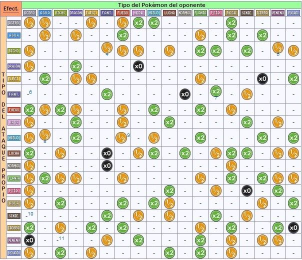

# M03-UF1NF2-Bidimensional


## Atacs Pokemon


El youtuber Folagor03 contacta con nosotros para hacer un programa que nos muestre la tabla de tipos de Pokemon (tiene un problema serio con ello).
En la solución os dejo un fichero java con los datos necesarios: la tabla de tipos y los tipos de Pokemon. Es el fichero llamado Constantes,java, copialo a tu Proyecto, si lo quieres hacer de cero.



Explicación tabla

- 0.5: el atacante hace la mitad de daño al oponente (No es muy eficaz)
- 1: el atacante hace un daño neutro al oponente (No se da información) (en la imagen representa al -)
- 2: el atacante hace el doble de daño al oponente (Es muy eficaz)
- 0: el atacante hace un daño nulo al oponente (No afecta)


El menú per treballar serà el següent

 1. Mostrar impacto de atacante 1 al atacante 2 ***(Pedir 2 tipos de pokemon)***
 2. Mostrar debilidades para un tipo pokemon (los que tienen doble) ***(Pedir tipo pokemon)***
 3. Mostrar todos los daños para un tipo de pokemon. ***(Pedir tipo pokemon)***
 4. Mostrar con que pokemons es mas efectivo un tipo pokemon y contar cuantos hay. ***(Pedir tipo pokemon)***
 5. Mostrar todas las combinaciones de ataques que tenga la efectividad buscada y contar cuantos hay ***(pedir efectividad a buscar)***
 
Codigo ayuda
```sh
public static String[] tiposPokemon = {
                                            "ACERO", 
                                            "AGUA", 
                                            "BICHO",
                                            "DRAGÓN",
                                            "ELÉCTRICO",
                                            "FANTASMA",
                                            "FUEGO",
                                            "HADA",
                                            "HIELO",
                                            "LUCHA",
                                            "NORMAL",
                                            "PLANTA",
                                            "PSÍQUICO",
                                            "ROCA",
                                            "SINIESTRO",
                                            "TIERRA",
                                            "VENENO",
                                            "VOLADOR"
                                          };
 
 /*
        FILAS = Pokemon atacante
        COLUMNAS = Pokemon que recibe el ataque
         
        Significados de los números:
            - 0.5: el atacante hace la mitad de daño al oponente (No es muy eficaz) 
            - 1: el atacante hace un daño neutro al oponente (No se da información pero diremos neutro)
            - 2: el atacante hace el doble de daño al oponente (Es muy eficaz)
            - 0: el atacante hace un daño nulo al oponente (No afecta)
 
    */
    public static double[][] efectividadesPokemon = {
         
        /*ACERO   AGUA   BICHO   DRAGON   ELÉC   FANT   FUEGO   HADA   HIELO   LUCHA   NORMAL   PLANTA   PSI   ROCA   SINIE  TIERRA   VENENO   VOLADOR   */
         
        { 0.5   , 0.5  ,   1   ,   1    , 0.5  ,  1   ,  0.5   ,  2  ,   2   ,   1   ,    1    ,   1   ,  1   ,  2  ,   1   ,   1   ,    1   ,   1},   //ACERO
        {  1    , 0.5  ,   1   ,  0.5   ,  1   ,  1   ,   2    ,  1  ,   1   ,   1   ,    1    ,  0.5  ,  1   ,  2  ,   1   ,   2   ,    1   ,   1},   //AGUA
        { 0.5   ,  1   ,   1   ,   1    ,  1   , 0.5  ,  0.5   , 0.5 ,   1   ,  0.5  ,    1    ,   2   ,  2   ,  1  ,   2   ,   1   ,   0.5  ,  0.5},  //BICHO
        { 0.5   ,  1   ,   1   ,   2    ,  1   ,  1   ,   1    ,  0  ,   1   ,   1   ,    1    ,   1   ,  1   ,  1  ,   1   ,   1   ,    1   ,   1},   // DRAGÓN
        {  1    ,  2   ,   1   ,  0.5   , 0.5  ,  1   ,   1    ,  1  ,   1   ,   1   ,    1    ,  0.5  ,  1   ,  1  ,   1   ,   0   ,    1   ,   2},   // ELÉCTRICO
        {  1    ,  1   ,   1   ,   1    ,  1   ,  2   ,   1    ,  1  ,   1   ,   1   ,    0    ,   1   ,  2   ,  1  ,  0.5  ,   1   ,    1   ,   1},   // FANTASMA
        {  2    , 0.5  ,   2   ,  0.5   ,  1   ,  1   ,  0.5   ,  1  ,   2   ,   1   ,    1    ,   2   ,  1   , 0.5 ,   1   ,   1   ,    1   ,   1},   // FUEGO
        { 0.5   ,  1   ,   1   ,   2    ,  1   ,  1   ,  0.5   ,  1  ,   1   ,   2   ,    1    ,   1   ,  1   ,  1  ,   2   ,   1   ,   0.5  ,   1},   // HADA
        { 0.5   , 0.5  ,   1   ,   2    ,  1   ,  1   ,  0.5   ,  1  ,  0.5  ,   1   ,    1    ,   2   ,  1   ,  1  ,   1   ,   2   ,    1   ,   2},   // HIELO
        {  2    ,  1   ,  0.5  ,   1    ,  1   ,  0   ,   1    , 0.5 ,   2   ,   1   ,    2    ,   1   , 0.5  ,  2  ,   2   ,   1   ,   0.5  ,  0.5},  // LUCHA
        { 0.5   ,  1   ,   1   ,   1    ,  1   ,  0   ,   1    ,  1  ,   1   ,   1   ,    1    ,   1   ,  1   , 0.5 ,   1   ,   1   ,    1   ,   1},   // NORMAL
        { 0.5   ,  2   ,  0.5  ,  0.5   ,  1   ,  1   ,  0.5   ,  1  ,   1   ,   1   ,    1    ,  0.5  ,  1   ,  2  ,   1   ,   2   ,   0.5  ,  0.5},  // PLANTA
        { 0.5   ,  1   ,   1   ,   1    ,  1   ,  1   ,   1    ,  1  ,   1   ,   2   ,    1    ,   1   , 0.5  ,  1  ,   0   ,   1   ,    2   ,   1},   // PSÍQUICO
        { 0.5   ,  1   ,   2   ,   1    ,  1   ,  1   ,   2    ,  1  ,   2   ,  0.5  ,    1    ,   1   ,  1   ,  1  ,   1   ,  0.5  ,    1   ,   2},   // ROCA
        {  1    ,  1   ,   1   ,   1    ,  1   ,  2   ,   1    , 0.5 ,   1   ,  0.5  ,    1    ,   1   ,  2   ,  1  ,  0.5  ,   1   ,    1   ,   1},   // SINIESTRO
        {  2    ,  1   ,  0.5  ,   1    ,  2   ,  1   ,   2    ,  1  ,   1   ,   1   ,    1    ,  0.5  ,  1   ,  2  ,   1   ,   1   ,    2   ,   0},   // TIERRA
        {  0    ,  1   ,   1   ,   1    ,  1   , 0.5  ,   1    ,  2  ,   1   ,   1   ,    1    ,   2   ,  1   , 0.5 ,   1   ,  0.5  ,   0.5  ,   1},   // VENENO
        { 0.5   ,  1   ,   2   ,   1    , 0.5  ,  1   ,   1    ,  1  ,   1   ,   2   ,    1    ,   2   ,  1   , 0.5 ,   1   ,   1   ,    1   ,   1}    // VOLADOR
    };
```
